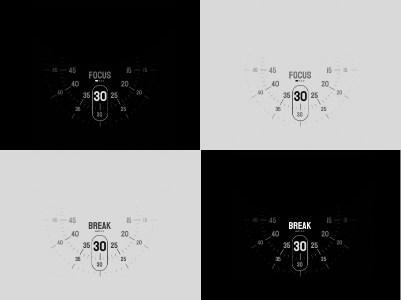

<br />
<div align="center">
    

  <h3 align="center">Gadi: Pomodoro Timer</h3>

  <p align="center">
    Gadi (/gɒd.i/) is an opensource minimal cross platform pomodoro timer.
    <br />
  </p>
</div>
<div align="center">
    
</div>

## Getting Started

COMING SOON...

## Todo

- [ ] Implement clock interface with CustomPaint class.
- [ ] Implement clock timer
- [ ]

## Features

- [ ] Custom Pomodoro Timer
- [ ] Break Time Adjustment
- [ ] Session Adjustment
- [ ] Focus/Break Metrics
- [ ] Full Screen Break Mode
- [ ] Focus Music
- [ ] Macos Menu Bar Support
- [ ] Android/Ios Always on Display Mode integration

<!-- ### Prerequisites and Installation

To run and build the application you need Flutter 3.0 installed. Follow the oficial documentation at [Flutter Installation Guide](https://docs.flutter.dev/get-started/install).
* Run flutter doctor
  ```sh
  flutter doctor -v
  ```
 * Install flutter packages
  ```sh
  flutter pub get
  ```
* Run flutter run command
  ```sh
  # Use -d to specify the device
  flutter run -d macos
  ```  -->
